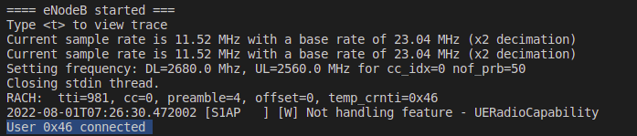
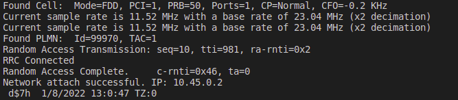
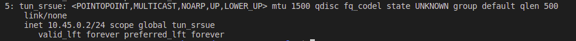
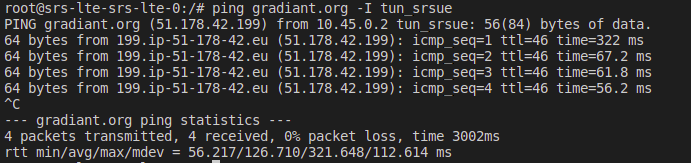
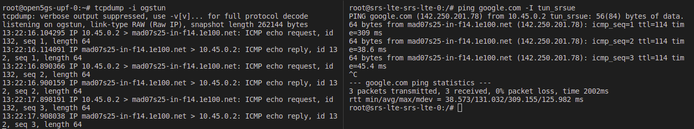

# Open5gs and srsLTE 

4G end to end communication demo with Open5gs and srsRAN.

This setup uses 2 helm charts generated by Gradiant in OpenVerso: `open5gs` and `srs-lte`.

Once this repo has been cloned, the instructions provided below are supposed to be executed from this path: `docs/open5gs-srslte/`.

# Deployment EPC and registration of subscribers

First, deploy the EPC (open5gs) using the `epc-values.yaml` file provided in order to overwrite some of the default values in `../../charts/open5gs/values.yaml`:

```
helm install open5gs ../../charts/open5gs/ --values epc-values.yaml
```

These new values will:

- Disable the Open5gs NGC, deploying only the components of the Open5gs 4G/5G NSA Core.
- Set the MCC, MNC and TAC to be used by the MME.
- Disable the Ingress for accessing the Open5GS WebUI. 

Once this deployment has been completed, register a subscriber in the EPC by running the script provided, `register_subscriber.sh`:

```
./register_subscriber.sh
```
Its execution will manually add the values specified in this script (**IMSI, KI and OPc**) to MongoDB. The changes can be verified following 2 different approaches:

1. **Directly through MongoDB**

```
kubectl exec deployment/open5gs-mongodb -ti -- bash

mongo

use open5gs

db.subscribers.find().pretty()
```
2. **Using the Open5GS WebUI**: forward a local port to a port on the corresponding Pod by specifying the WebUI Service. Then, the Open5GS WebUI will be available at `localhost:3000`. To do this, execute:
```
kubectl port-forward svc/open5gs-webui 3000:3000
```


# Deployment RAN

Now, deploy the RAN (srs-lte) using the `lte-values.yaml` file provided in order to overwrite some of the default values in `../../charts/srs-lte/values.yaml`:

```
helm install srs-lte ../../charts/srs-lte/ --values lte-values.yaml
```

Thus, this deployment will not only launch the **eNodeB** and connect it to the Open5GS EPC, but it will also enable the launching of **1 UE**.

It is important to notice that the default values of **MCC, MNC, and TAC** set for the eNB match those configured in the **open5gs** chart. Also, the **IMSI, KI and OPc** given for the UE match the ones provided in `register_subscriber.sh`.


# Verify deployment

## Connection between PGW-C and PGW-U (C-Plane and U-Plane of EPC)

Check that the PGW-C (SMF component) gets associated with the PGW-U's (UPF component) address:
```
kubectl logs deployment/open5gs-smf -f
```

## Connection between MME and eNodeB

Check that the MME accepts and adds the eNodeB:
```
kubectl logs deployment/open5gs-mme -f
```

## UE's connectivity

Check that the eNodeB senses UE's presence and the UE gets connected to the network:
```
kubectl logs srs-lte-srs-lte-0 enb -f
```


Check that the UE got successfully attached to the network:
 ```
kubectl logs srs-lte-srs-lte-0 ue -f
```


Hence, check that the UE created a tunnel interface (`tun_srsue`):
```
kubectl exec srs-lte-srs-lte-0 -c ue -ti -- bash

ip addr
```



Check that the UE has connectivity through this interface:
```
ping gradiant.org -I tun_srsue
```


Moreover, if using `traceroute`, check that the first hop is `10.45.0.1` (PGW-U's side of the tunnel created):
```
trarecout google.com -i tun_srsue
```


Therefore, the UE's traffic can be captured in the PGW-U (UPF). The installation of **tcpdump** in the corresponding pod is needed in order to complete this check:
```
kubectl exec open5gs-upf-0 -ti -- bash

apt update && apt install tcpdump

tcpdump -i ogstun
```


# Clean
Clean the deployment for this demo by uninstalling the 2 helm charts previously installed:
```
helm uninstall srs-lte

helm uninstall open5gs
```