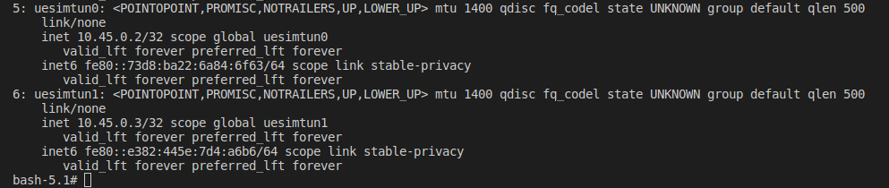
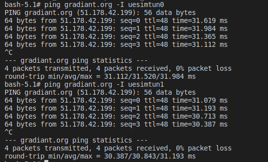
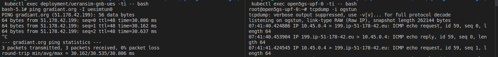

# Open5gs and UERANSIM 

5G end to end (SA) communication demo with Open5gs and UERANSIM.

This setup uses 2 helm charts generated by Gradiant in OpenVerso: `open5gs` and `ueransim-gnb`.

Once this repo has been cloned, the instructions provided below are supposed to be executed from this path: `docs/open5gs-ueransim-gnb/`.

# Deployment NGC and registration of subscribers

First, deploy the NGC (open5gs) using the `5gSA-values.yaml` file provided in order to overwrite some of the default values in `../../charts/open5gs/values.yaml`:

```
helm install open5gs ../../charts/open5gs/ --values 5gSA-values.yaml
```

These new values will:

- Disable the Open5gs EPC, deploying only the functions of the Open5gs 5G SA Core.
- Enable the *populate* option, which will create a Deployment using the `openverso/open5gs-dbctl` image. This will provide an easy way to manage the subscribers. In addition, the *commands* specified will register two subscribers initially, with the *imsi, key, opc, apn, sst* and *sd* provided. 


# Deployment RAN

Now, deploy the RAN (ueransim-gnb) using the `gnb-ues-values.yaml` file provided in order to overwrite some of the default values in `../../charts/ueransim-gnb/values.yaml`:

```
helm install ueransim-gnb ../../charts/ueransim-gnb/ --values gnb-ues-values.yaml
```

Thus, this deployment will not only launch the **gNodeB**, but it will also enable the launching of **2 UEs**. They will use consecutive MSIDNs, starting from the ***ues.initialMSISDN*** set in the ***values.yaml*** (0000000001, by default).

It is important to notice that the default values of **mcc, mnc, sst, sd and tac** match those configured in the **open5gs** chart and the registered UEs.


# Verify deployment

## Connection between SMF and UPF (C-Plane and U-Plane of NGC)

Check that the SMF gets associated with the UPF's address:
```
kubectl logs deployment/open5gs-smf -f
```

## Connection between AMF and gNodeB

Check that the AMF accepts and adds the gNodeB:
```
kubectl logs deployment/open5gs-amf -f
```

Check that gNodeB establishes SCTP connection successfully and that the NG Setup procedure was successful as well:
```
kubectl logs deployment/ueransim-gnb -f
```

## UE's connectivity
Check that both UEs established their PDU Session successfully, creating each of them one tunnel interface (`uesimtun0` and `uesimtun1`):
```
kubectl exec deployment/ueransim-gnb-ues -ti -- bash

ip addr
```



Check that UEs have connectivity through these interfaces:
```
ping gradiant.org -I uesimtun0

ping gradiant.org -I uesimtun1
```


It's even possible to check that the UEs' traffic is being routed correctly through their PDU sessions, capturing the packets in the UPF. The installation of **tcpdump** in the corresponding pod is needed in order to complete this check:
```
kubectl exec open5gs-upf-0 -ti -- bash

apt update && apt install tcpdump

tcpdump -i ogstun
```


# Add additional subscribers using *open5gs-populate*

Once the NGC is deployed, we can register additional subscribers at any time by using the Deployment previously described:
```
kubectl exec deployment/open5gs-populate -ti -- bash
```

From there, we can register a new subscriber by executing the following command, providing the corresponding values for *imsi, key, opc, apn, sst* and *sd*:
```
open5gs-dbctl add_ue_with_slice <imsi> <key> <opc> <apn> <sst> <sd>
```

After that, the changes can be verified in MongoDB:
```
kubectl exec deployment/open5gs-mongodb -ti -- bash

mongo

use open5gs

db.subscribers.find().pretty()
```

# Clean
Cleand the deployment for this demo by uninstalling the 2 helm charts previously installed:
```
helm uninstall ueransim-gnb

helm uninstall open5gs
```
